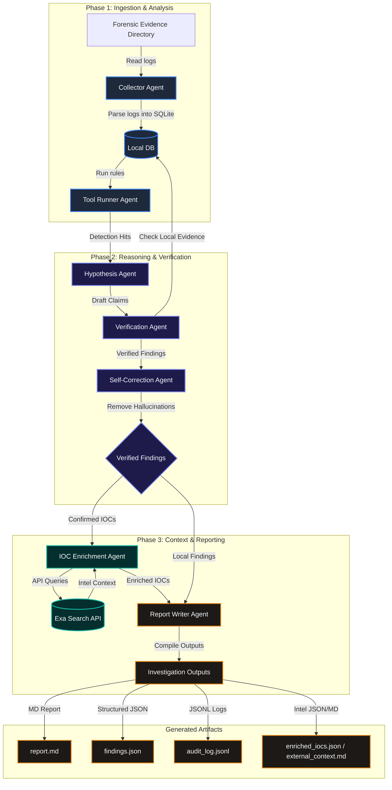

# 🔍 EvilTrace AI — Autonomous DFIR Incident Response Agent

> **FIND EVIL Devpost Hackathon Submission**

EvilTrace AI is a modular, multi-agent Digital Forensics and Incident Response (DFIR) system that ingests real forensic evidence (Sysmon logs, Zeek connection logs, Auth logs), generates security hypotheses, verifies every claim against exact artifacts, self-corrects LLM hallucinations, and produces judge-ready forensic reports and full audit trails.

---

## 🚀 Key Features

* **Multi-Agent DFIR Pipeline:** Orchestrated sequence of specialized agents:
  `Collector Agent ➔ Tool Runner Agent ➔ Hypothesis Agent ➔ Verification Agent ➔ Self-Correction Agent ➔ IOC Enrichment Agent ➔ Report Agent`.
* **Zero-Hallucination Gate:** A strict verification layer that rejects LLM-asserted hypotheses (like Credential Dumping or Exfiltration) unless exact artifact evidence (e.g., Mimikatz commands, Procdump target to LSASS, or outbound volume sizes) is verified in the logs.
* **Exa IOC Enrichment:** An optional external threat-intelligence enrichment step that queries the Exa Search API for confirmed IOCs. It behaves strictly as informational context and never modifies finding veracity or conclusions.
* **Offline-First (Mock Mode):** Runs fully locally and deterministically without an internet connection or API keys.
* **Streamlit Web Dashboard:** Interactive UI for uploading evidence, viewing findings severity summaries, interactive chronological timelines, extracted IOC lists, enriched external context, and complete agent audit trails.
* **Full Audit Logging:** Tracks all agent decisions, run parameters, raw LLM prompts, tokens used, and cost estimations in an RFC-compliant `audit_log.jsonl` trail.

---

## 🛠️ System Architecture

To provide full transparency, rigorous evidence verification, and zero hallucinations, EvilTrace AI employs a structured, multi-agent pipeline. Below are the architectural schematics and data flow diagrams.

### 1. High-Level Multi-Agent Architecture


### 2. Step-by-Step Agent Collaboration & Data Flow


### 3. Interactive Pipeline Flowchart



### 1. Ingestion & Analysis (Phase 1)
* **Evidence Collector Agent:** Recursively crawls and ingests log files, dynamically identifying formats (Sysmon JSON/CSV, Zeek connection TSV, Linux Auth logs). Ingested events are normalized and written to a unified SQLite database.
* **Tool Runner Agent:** Performs high-speed rule-based matching over database tables to generate detection markers (PowerShell obfuscation, large data transfers, beaconing, etc.).

### 2. Reasoning & Verification (Phase 2)
* **Hypothesis Agent:** Interprets detection hits to draft structured security claims and tactics.
* **Verification Agent:** Serves as a strict evidence gate, verifying claims against local forensic records (e.g. validating Mimikatz usage, comsvcs dump patterns, or transfer volumes) and demoting unverified assertions.
* **Self-Correction Agent:** A sanity check loop that runs verification rules and demotes/corrects LLM hallucinations, ensuring all final report conclusions are backed by verified evidence.

### 3. Threat-Intel Context & Reporting (Phase 3)
* **IOC Enrichment Agent (Optional):** Extracts confirmed indicators of compromise (IOCs) and retrieves context from the Exa Search API, separating unverified weak indicators from confirmed findings.
* **Report Writer Agent:** Assembles final reports, timelines, and audit logs, generating clean findings summaries.

---

## 📦 Getting Started

### Prerequisites

* Python 3.10+
* (Optional) Google Gemini API Key

### Installation

1. Clone the repository:
   ```bash
   git clone https://github.com/ibrahimsaleem/Evil-Trace.git
   cd Evil-Trace
   ```

2. Install the dependencies:
   ```bash
   pip install -r eviltrace/requirements.txt
   ```

3. (Optional) Set up your Gemini and Exa API Keys in a `.env` file at the root of the project:
   ```env
   GEMINI_API_KEY="your-api-key-here"
   EXA_API_KEY="your-exa-api-key-here"
   ```

---

## 💻 Usage

### 1. Command Line Interface (CLI)

Run an investigation over the provided sample forensic data:

```bash
# Run in Mock Mode (Deterministic, offline)
python eviltrace/main.py --evidence eviltrace/sample_evidence --output outputs/report.md --provider mock

# Run using Gemini LLM (Loads API key automatically from .env)
python eviltrace/main.py --evidence eviltrace/sample_evidence --output outputs/report.md --provider gemini --model gemini-3.5-flash

# Run with Exa threat intelligence enrichment enabled (Requires EXA_API_KEY in .env)
python eviltrace/main.py --evidence eviltrace/sample_evidence --output outputs/report.md --provider mock --enable-exa
```

### 2. Streamlit Web Dashboard

Start the interactive dashboard:

```bash
streamlit run eviltrace/app.py
```
Open `http://localhost:8501` in your browser to inspect findings, view the interactive timeline table, download IOCs, enable Exa threat intelligence searches, and read the agent audit logs.

---

## 🧪 Running Tests

A comprehensive unit and integration test suite is included under `eviltrace/tests/`:

```bash
pytest eviltrace/tests/test_eviltrace.py
```

---

## 📄 Output Deliverables

The investigation generates the following files in your output directory:

* `report.md`: The final human-readable DFIR incident report.
* `findings.json`: Structured list of confirmed and rejected findings.
* `timeline.json`: A chronological database of parsed security events.
* `iocs.csv`: Extracted indicators of compromise (IPs, domains, URLs, hashes).
* `audit_log.jsonl`: Verifiable transaction log of every agent action and LLM cost.
* `accuracy_summary.md`: Summary of self-correction performance.
* `enriched_iocs.json`: (Optional) Detailed external threat-intel metrics fetched from Exa.
* `external_context.md`: (Optional) Exa search snippets and highlights for enriched IOCs.

