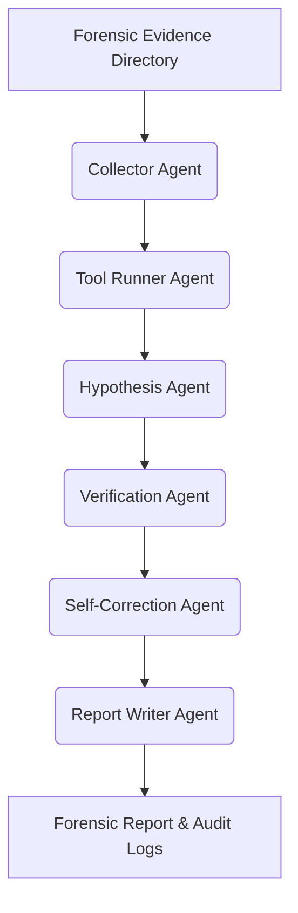

# 🔍 EvilTrace AI — Autonomous DFIR Incident Response Agent

> **FIND EVIL Devpost Hackathon Submission**

EvilTrace AI is a modular, multi-agent Digital Forensics and Incident Response (DFIR) system that ingests real forensic evidence (Sysmon logs, Zeek connection logs, Auth logs), generates security hypotheses, verifies every claim against exact artifacts, self-corrects LLM hallucinations, and produces judge-ready forensic reports and full audit trails.

---

## 🚀 Key Features

* **Multi-Agent DFIR Pipeline:** Orchestrated sequence of specialized agents:
  `Collector Agent ➔ Tool Runner Agent ➔ Hypothesis Agent ➔ Verification Agent ➔ Self-Correction Agent ➔ Report Agent`.
* **Zero-Hallucination Gate:** A strict verification layer that rejects LLM-asserted hypotheses (like Credential Dumping or Exfiltration) unless exact artifact evidence (e.g., Mimikatz commands, Procdump target to LSASS, or outbound volume sizes) is verified in the logs.
* **Offline-First (Mock Mode):** Runs fully locally and deterministically without an internet connection or API keys.
* **Streamlit Web Dashboard:** Interactive UI for uploading evidence, viewing findings severity summaries, interactive chronological timelines, extracted IOC lists, and complete agent audit trails.
* **Full Audit Logging:** Tracks all agent decisions, run parameters, raw LLM prompts, tokens used, and cost estimations in an RFC-compliant `audit_log.jsonl` trail.

---

## 🛠️ System Architecture



1. **Evidence Collector:** Scans directories for Windows Sysmon (JSON/CSV), Zeek connection logs (TSV), Linux Auth logs (LOG/TXT), parses, and populates a local evidence database.
2. **Tool Runner:** Executes deterministic detection rules to locate threat indicators.
3. **Hypothesis Agent:** Formulates security threat claims using LLM reasoning.
4. **Verification Agent:** Verifies claims against strict regex, size, and keyword criteria.
5. **Self-Correction:** Cross-checks claims for consistency and flags hallucinated claims as "rejected".
6. **Report Writer:** Outputs structured results into 6 markdown, CSV, and JSON deliverables.

---

## 📦 Getting Started

### Prerequisites

* Python 3.10+
* (Optional) Google Gemini API Key

### Installation

1. Clone the repository:
   ```bash
   git clone https://github.com/ibrahimsaleem/Evil-Trace.git
   cd Evil-Trace
   ```

2. Install the dependencies:
   ```bash
   pip install -r eviltrace/requirements.txt
   ```

3. (Optional) Set up your Gemini API Key in a `.env` file at the root of the project:
   ```env
   GEMINI_API_KEY="your-api-key-here"
   ```

---

## 💻 Usage

### 1. Command Line Interface (CLI)

Run an investigation over the provided sample forensic data:

```bash
# Run in Mock Mode (Deterministic, offline)
python eviltrace/main.py --evidence eviltrace/sample_evidence --output outputs/report.md --provider mock

# Run using Gemini LLM (Loads API key automatically from .env)
python eviltrace/main.py --evidence eviltrace/sample_evidence --output outputs/report.md --provider gemini --model gemini-3.5-flash
```

### 2. Streamlit Web Dashboard

Start the interactive dashboard:

```bash
streamlit run eviltrace/app.py
```
Open `http://localhost:8501` in your browser to inspect findings, view the interactive timeline table, download IOCs, and read the agent audit logs.

---

## 🧪 Running Tests

A comprehensive unit and integration test suite is included under `eviltrace/tests/`:

```bash
pytest eviltrace/tests/test_eviltrace.py
```

---

## 📄 Output Deliverables

The investigation generates the following files in your output directory:

* `report.md`: The final human-readable DFIR incident report.
* `findings.json`: Structured list of confirmed and rejected findings.
* `timeline.json`: A chronological database of parsed security events.
* `iocs.csv`: Extracted indicators of compromise (IPs, domains, URLs, hashes).
* `audit_log.jsonl`: Verifiable transaction log of every agent action and LLM cost.
* `accuracy_summary.md`: Summary of self-correction performance.
