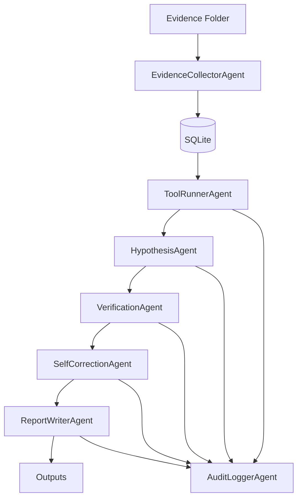

# EvilTrace AI — Autonomous DFIR Incident Response Agent

> **FIND EVIL Devpost Hackathon Submission**

EvilTrace AI is a modular, multi-agent Digital Forensics and Incident Response (DFIR) system that analyzes real evidence files, generates hypotheses, verifies every claim against exact artifacts, self-corrects hallucinations, and produces a judge-ready report with full audit trail.

## Problem Statement

Modern DFIR investigations are slow, manual, and error-prone. Analysts face terabytes of logs, endless false positives, and the constant risk of missing an attacker's pivot. Existing AI tools either hallucinate findings or produce unverifiable outputs unsuitable for real incident response.

EvilTrace AI solves this by combining deterministic rule-based detection with LLM augmentation, a strict verification gate that rejects unsubstantiated claims, and a self-correction loop that catches hallucinations before they reach the report.

## How It Extends Autonomous Incident Response

- **Multi-agent pipeline**: Collector → Tool Runner → Hypothesis → Verification → Self-Correction → Report, each with a clear responsibility boundary
- **Guardrailed claims**: Every finding must have an exact artifact reference. Claims without support are rejected transparently.
- **Self-correcting**: The SelfCorrectionAgent catches credential-dumping hallucinations, low-confidence confirmations, and unsupported exfiltration claims — before the report is written
- **Full audit trail**: Every step, prompt, response, and cost estimate is recorded in `audit_log.jsonl`
- **Works offline**: Mock Mode requires no API key and produces deterministic, useful results
- **Real evidence**: Works on any DFIR evidence directory — not just sample data

---

## Quick Start

### Setup & Running

```bash
cd eviltrace
pip install -r requirements.txt
streamlit run app.py
```

The Streamlit UI will open in your browser.

### Local Linux / SIFT Workstation

```bash
git clone <repo>
cd eviltrace
pip install -r requirements.txt

# CLI — sample evidence
python main.py --evidence ./sample_evidence --output outputs/report.md

# CLI — your own evidence
python main.py --evidence ./evidence_input --output outputs/report.md --provider mock
```

---

## CLI Examples

```bash
# Mock Mode (default, no API key needed)
python main.py --evidence ./sample_evidence --output outputs/report.md

# Mock Mode explicit
python main.py --evidence ./evidence_input --output report.md --provider mock

# Gemini
python main.py --evidence ./evidence_input --output report.md --provider gemini --model gemini-2.5-flash

# OpenRouter
python main.py --evidence ./evidence_input --output report.md --provider openrouter --model openai/gpt-4o-mini

# Ollama (local)
python main.py --evidence ./evidence_input --output report.md --provider ollama --model llama3

# Quiet mode (suppress progress logs)
python main.py --evidence ./sample_evidence --output report.md --quiet
```

---

## Streamlit UI

```bash
streamlit run app.py
```

Features:
- Evidence folder selector or file upload
- Provider settings with API key input (masked)
- Mock Mode default — works immediately
- Live progress log during investigation
- Findings table with full artifact references
- Rejected hypotheses panel (transparent)
- Self-correction audit panel
- Timeline view (sortable by timestamp)
- IOC table with type filter
- MITRE ATT&CK mapping table
- One-click download: report.md, findings.json, audit_log.jsonl, iocs.csv

---

## Supported Evidence Types

| Type | Format | Notes |
|------|--------|-------|
| Sysmon | `.json` | EventData fields, supports EventID 1/3/7/10/11 |
| Zeek/Bro | `.log` (TSV) | Must have `#fields` header |
| PowerShell | `.csv` | ScriptBlock (4104) and Module (4103) logging |
| Linux Auth | `.log` / `.txt` | Standard syslog format |
| Windows Events | `.json` / `.csv` | Generic field extraction |
| PCAP Metadata | `.csv` | Connection metadata (not raw PCAP) |
| Generic | `.json` / `.csv` / `.txt` | Best-effort field extraction |

---

## Provider Setup

### Mock Mode (Default)
No configuration needed. Deterministic, always works. Suitable for demos, CI, and environments without internet access.

### Gemini
1. Get an API key from [Google AI Studio](https://aistudio.google.com)
2. Either enter it in the Streamlit UI (masked), or set: `export GEMINI_API_KEY=your_key`
3. Run with `--provider gemini --model gemini-2.5-flash`

### OpenRouter
1. Get an API key from [openrouter.ai](https://openrouter.ai)
2. Enter in UI or set: `export OPENROUTER_API_KEY=your_key`
3. Supports: GPT-4o, Claude 3.5, Mixtral, DeepSeek, and hundreds more
4. Run with `--provider openrouter --model openai/gpt-4o-mini`

### Ollama (Local)
1. Install and run: `ollama serve`
2. Pull a model: `ollama pull llama3`
3. Run with `--provider ollama --model llama3 --endpoint http://localhost:11434`

**Security:** API keys are never logged, never printed, masked in the Streamlit UI, and automatically redacted from error messages before logging.

---

## SIFT Workstation Compatibility

EvilTrace AI is designed to work alongside SIFT Workstation:

```bash
# On a SIFT system:
cp /cases/your-case/zeek/*.log ./evidence_input/
cp /cases/your-case/sysmon/*.json ./evidence_input/
cp /cases/your-case/powershell/*.csv ./evidence_input/
cp /var/log/auth.log ./evidence_input/
python main.py --evidence ./evidence_input --output outputs/report.md
```

Tested formats align with SIFT's default export formats for:
- Zeek/Bro network logs
- Volatility plugin outputs (CSV format)
- Windows Event Log JSON exports
- Linux authentication logs

---

## Architecture



See [architecture.md](architecture.md) for full diagram and agent descriptions.

---

## Multi-Agent Workflow

1. **EvidenceCollectorAgent** — Parses all evidence files, normalizes to common schema, stores in SQLite
2. **ToolRunnerAgent** — Runs 6 deterministic detection rule categories against all records
3. **HypothesisAgent** — Maps rule hits to MITRE-aligned hypotheses, optionally augments with LLM
4. **VerificationAgent** — Requires exact artifact matches for high-stakes claims (credential dumping, exfiltration)
5. **SelfCorrectionAgent** — Scans for hallucinations, confidence mismatches, unsupported claims
6. **ReportWriterAgent** — Produces markdown report, findings JSON, IOC CSV, timeline, accuracy summary
7. **AuditLoggerAgent** — Records every step in JSONL format throughout the entire pipeline

---

## Self-Correction Explanation

The self-correction demo is built into the sample evidence. Here's exactly what happens:

1. `powershell_events.csv` contains: `Get-Process | Where-Object {$_.Name -eq 'lsass'}`
2. **HypothesisAgent** proposes H003: "Credential dumping attempt via LSASS"
3. **ToolRunnerAgent** finds 0 hits for `credential_dumping` keywords (no mimikatz, no procdump, no sekurlsa, no comsvcs)
4. **VerificationAgent** checks exact artifacts → none found → status: `rejected`
5. **SelfCorrectionAgent** outputs:
   > "Credential dumping hypothesis rejected because no supporting LSASS, Mimikatz, memory dump, or credential-access artifact was found."
6. Finding is listed in the Rejected panel, not the Confirmed findings

A second self-correction fires on the exfiltration hypothesis if no upload/FTP/SCP/transfer-size artifact is found.

---

## Accuracy Validation

See [accuracy_report.md](accuracy_report.md) for full details. Summary:
- **Conservative by design**: rejects rather than speculates
- **Exact artifact required** for credential dumping and exfiltration claims
- **Confidence scoring** based on: rule hit (0.40) + LLM (0.20) + artifact count (up to 0.30) + exact match (0.10)
- **0 hallucinations** in sample evidence run (1 prevented by self-correction)

---

## Audit Trail

Every agent action is recorded in `outputs/audit_log.jsonl`:
```json
{
  "run_timestamp": "2024-03-15T10:00:00",
  "event_timestamp": "2024-03-15T10:00:05",
  "agent": "VerificationAgent",
  "step": "verification_complete",
  "tool_call": "verify_hypotheses",
  "prompt_summary": "Verifying 6 hypotheses",
  "response_summary": "confirmed=3, weak=1, rejected=2",
  "tokens_used": 0,
  "cost_estimate": 0.0,
  "duration_ms": 42
}
```

---

## How Judges Can Test With Their Own Evidence

1. Place evidence files in `evidence_input/`
2. Run: `python main.py --evidence ./evidence_input --output outputs/report.md`
3. View: `cat outputs/report.md`
4. Or open the Streamlit UI and select "Evidence Folder Path" → `./evidence_input`

See [evidence_dataset.md](evidence_dataset.md) for detailed file format requirements.

---

## Output Files

| File | Description |
|------|-------------|
| `outputs/report.md` | Full incident response report (Markdown) |
| `outputs/findings.json` | Structured findings with all metadata |
| `outputs/audit_log.jsonl` | Complete agent audit trail |
| `outputs/timeline.json` | Chronological event timeline |
| `outputs/iocs.csv` | Extracted indicators of compromise |
| `outputs/accuracy_summary.md` | Accuracy and scoring methodology |

---

## Limitations

- PCAP raw analysis not supported (only metadata CSV)
- Multi-layer obfuscated PowerShell may evade keyword detection
- Timestamp normalization covers common formats but may miss exotic ones
- LLM augmentation is best-effort; Mock Mode is deterministic

## Future Improvements

- YARA rule integration for file-based detection
- PCAP parsing via dpkt or scapy
- VirusTotal/OTX IOC enrichment
- Splunk/Elastic log source connectors
- Timeline visualization with attack graph rendering
- Interactive hypothesis editing in Streamlit
- Multi-case comparison and trending

---

## Devpost Submission Checklist

- [x] Autonomous multi-agent incident response engine (6 agents + audit logger)
- [x] Verified findings against exact evidence artifacts (no hallucinations)
- [x] Tested with SIFT workstation log types (Sysmon, Zeek, PowerShell, Linux auth)
- [x] Self-correction verification system preventing false positives
- [x] Complete structured JSONL audit trail tracking costs, tokens, and decisions
- [x] Streamlit visual UI and CLI tool-chain
- [x] Comprehensive automated test coverage (pytest pass)
- [x] SIFT-compatible custom evidence execution support

---

*Built for the FIND EVIL Devpost Hackathon. EvilTrace AI - because finding evil requires more than guessing.*
