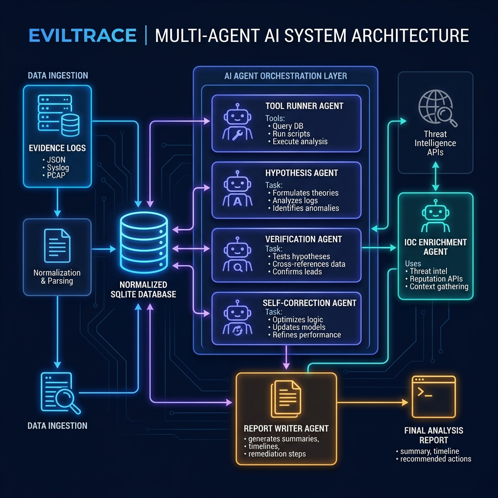
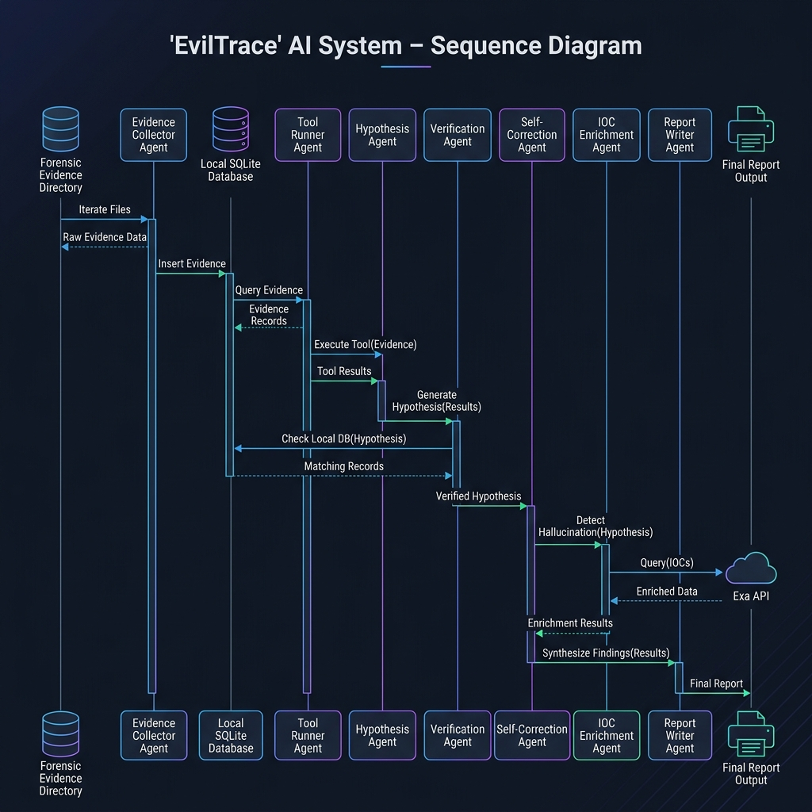
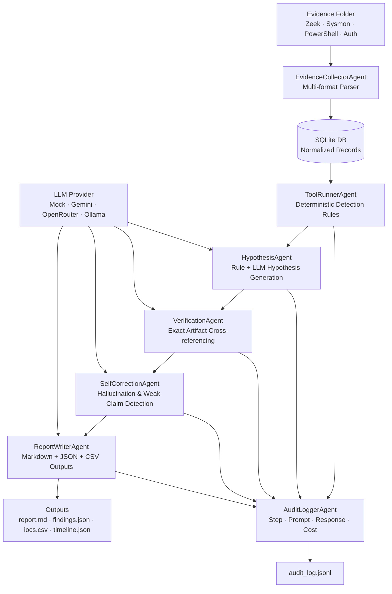

# EvilTrace AI — Architecture

## System Architecture

To provide full transparency, rigorous evidence verification, and zero hallucinations, EvilTrace AI employs a structured, multi-agent pipeline. Below are the architectural schematics and data flow diagrams.

### 1. High-Level Multi-Agent Architecture


### 2. Step-by-Step Agent Collaboration & Data Flow


### 3. Interactive Pipeline Flowchart



## Agent Descriptions

### EvidenceCollectorAgent
- Scans evidence directory recursively for `.json`, `.csv`, `.log`, `.txt` files
- Auto-detects file type by name and content (Sysmon JSON, Zeek TSV, Linux syslog, generic CSV/JSON)
- Normalizes all records to a common schema: `timestamp`, `host`, `user`, `process`, `command_line`, `src_ip`, `dst_ip`, `domain`, `hash`, `file_path`, `event_type`, `raw_record`
- Inserts all records into SQLite for structured querying
- Clears previous run data to ensure clean investigation state

### ToolRunnerAgent
- Runs deterministic keyword-matching detection rules against all normalized records
- **Categories detected:**
  - `suspicious_powershell`: encoded commands, IEX, bypass, AMSI, download methods
  - `credential_dumping`: mimikatz, lsass, procdump, sekurlsa, comsvcs, NTDS
  - `lateral_movement`: psexec, wmic, winrm, net use admin$, invoke-command
  - `download_execution`: curl, wget, IWR, DownloadFile, certutil, bitsadmin
  - `exfiltration_indicators`: upload, FTP put, SCP, large outbound byte counts
  - `beaconing`: repeated connections (≥3) from same source to same external IP
- All hits include matched keyword, source file, line number, timestamp

### HypothesisAgent
- Maps tool results to 6 structured hypothesis templates
- Optionally augments with LLM plausibility assessment
- Computes confidence score: `rule_hit(0.40) + llm_hit(0.20) + artifact_count(up to 0.30) + exact_match(0.10)`
- Maps each hypothesis to MITRE ATT&CK tactic/technique/ID
- Works fully in Mock Mode without any API key

### VerificationAgent
- Enforces strict evidence requirements per hypothesis category:
  - **Credential Dumping**: requires exact artifact matching `mimikatz|lsass|procdump|sekurlsa|comsvcs`
  - **Exfiltration**: requires upload/FTP/SCP artifact OR >100KB outbound transfer evidence
  - **Beaconing**: requires ≥5 repeated connections for "confirmed", ≥3 for "weak_evidence"
  - **All others**: requires rule hit and confidence ≥0.50 for confirmed status
- Returns one of: `confirmed`, `weak_evidence`, `rejected`
- Never confirms a claim that lacks exact artifact support

### SelfCorrectionAgent
- Scans all verified findings for:
  - **Hallucination prevention**: credential dumping confirmed without LSASS artifact
  - **Weak claim flagging**: exfiltration without transfer-size evidence
  - **Confidence mismatch**: confirmed status with confidence <0.50
  - **Unsupported C2 claims**: beaconing with insufficient connection count
- Demotes claims that fail checks
- Produces a correction log with type, description, and applied correction
- **Demo self-correction**: HypothesisAgent always proposes credential dumping (H003); VerificationAgent rejects it; SelfCorrectionAgent confirms the rejection with explicit explanation

### ReportWriterAgent
- Generates structured Markdown report with:
  - Executive Summary (LLM or mock)
  - Confirmed Findings (with full artifact references)
  - Weak Evidence Findings
  - Rejected Hypotheses (transparent, not hidden)
  - Self-Correction Log
  - IOC Table
  - MITRE ATT&CK Mapping Table
  - Audit Trail reference
- Also writes: `findings.json`, `timeline.json`, `iocs.csv`, `accuracy_summary.md`

### AuditLoggerAgent
- Records every agent step as a JSONL entry
- Fields: `run_timestamp`, `event_timestamp`, `agent`, `step`, `tool_call`, `prompt_summary`, `response_summary`, `tokens_used`, `cost_estimate`, `duration_ms`
- Appends to `outputs/audit_log.jsonl` in real time
- Provides complete traceability of all decisions

## Provider Abstraction

```
BaseProvider (abstract)
├── MockProvider     — deterministic, no API key, always works
├── GeminiProvider   — Google Gemini REST API, auto-fallback to Mock
├── OpenRouterProvider — OpenRouter REST API, auto-fallback to Mock
└── OllamaProvider   — Local Ollama HTTP, auto-fallback to Mock
```

All providers implement `complete(prompt, max_tokens) -> str` and auto-fall back to Mock with logged reason on any failure. API keys are never logged.

## Data Flow

```
Evidence Files
    ↓ parse_file() [parsers.py]
Normalized Records (List[Dict])
    ↓ insert_evidence() [database.py]
SQLite evidence table
    ↓ query_all_evidence()
Records in memory
    ↓ _search_records() / _detect_beaconing() [tool_runner.py]
Tool Results (Dict[category → List[hit]])
    ↓ HypothesisAgent.run()
Hypotheses (List[Dict] with confidence scores)
    ↓ VerificationAgent.run()
Verified Findings (status: confirmed/weak/rejected)
    ↓ SelfCorrectionAgent.run()
Corrections applied, findings updated
    ↓ extract_iocs() [ioc_extractor.py]
IOCs (IP, domain, URL, hash, encoded PS)
    ↓ build_timeline() [timeline.py]
Sorted timeline events
    ↓ ReportWriterAgent.run()
outputs/report.md + findings.json + iocs.csv + timeline.json + audit_log.jsonl
```
